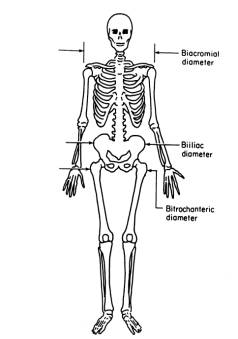

<!-- En haut, compliter/supprimer selon besoin. -->
<!-- Voir les consignes pour le projet. -->

```{r setup, include=FALSE}
knitr::opts_chunk$set(echo = TRUE)
knitr::opts_chunk$set(comment = "")
knitr::opts_chunk$set(warning = FALSE)

# libraries
library(pander)
library(FactoMineR)
library(corrplot)
library(resample)
library(factoextra)
library(VIM)

```
# Introduction

En 2003, Grete Heinz, Louis J. Peterson, Roger W. Johnson, et Carter J. Kerk ont mis en place une étude visant à explorer les relations entre les différentes dimensions du corps humain et d'autre caractéristiques. 

Pour 507 individus (247 hommes - 260 femmes), 25 mesures/observations, dont les noms et unités sont détaillés en annexe, ont été faites.

Un exemple de problématique très pertinente serait qu'un cadavre en mauvais état soit retrouvé et qu'une enquête soit ouverte. Dans un tel cas de figure, hormis les informations génétiques, les premières caractéristiques intéressantes sont l' _âge_, le _poid_, la _taille_ et le _sexe_ de l'individu retrouvé.

Ce rapport va analyser ces données en utlisant les méthodes vues au cours afin de voir, si oui ou non, l'idée d'utiliser certaines valeurs de variables pour en déduire d'autres est pertinente.  

L'objectif de cette étude était précisément d'offrir aux étudiants des données solides et pertinentes pour les analyser.

# Présentation des données, analyse descriptive
Il est important de garder en mémoire le fait que les données utilisées ont été mesurées sur des sujets adultes sains et en bonne forme physique.

```{r}
# download.file("https://www.openintro.org/book/statdata/bdims.csv", destfile = "bdims.csv")
data.initial <- read.csv("bdims.csv")
data.quantitative <- subset(data.initial, select = -c(length(data.initial)))
```

## Généralités
```{r echo=FALSE, warning = FALSE, fig.show="hold", out.width="50%"}
means = colMeans(data.initial)
barplot(means, main="Moyennes des variables", names.arg = names(data.initial), col=rainbow(20),  las = 2)

data.cm = subset(data.initial, select = c(length(data.initial)-4:length(data.initial)))
means = rowMeans(data.initial)
barplot(means, main="Moyennes des mesures de diamètre/circonférence", names.arg = seq(from=1, to= 507, by=1), col="black",  las = 2)
```

On voit sur ce barplot que les moyennes ne sont pas toutes comparables. Le genre (_sex_) étant une variable binaire (et donc aussi discrète), sa moyenne sera toujours bornée entre zéro et un, alors que pour les autres variables, qui sont des mesures naturelles, ca n'est pas le cas. On peut noter que la moyenne est sous 0.5, du fait qu'il y'a plus de femmes que d'hommes. De plus, les unités de mesure de distance (cm) et de poids (kg) ne sont pas non plus directement comparables. Néanmoins, on remarque déjà de fortes similarités de moyennes entre certains groupes de zones anatomiques (ex: les 9 premières, les 5 suivantes et 7 prochaines).


Ici, on peut observer la moyennes des mesures de diamètre et des mesures de circonférence de chaque individu. Cela ne nous apporte pas grand chose à première vue, mais il suffit déjà de prendre l'information du sexe pour remarquer une différence : les 247 premières moyennes sont des hommes, et les 260 dernières sont des femmes. On peut donc déjà supposer qu'une ou plusieurs de ces mesures sont corrélées à la variable catégorielle du genre.

```{r echo=FALSE, warning = FALSE, out.width="50%", fig.align="center"}
vars = colStdevs(data.initial)
barplot(vars, main="Écart-type des variables", names.arg = names(data.initial), col=rainbow(20),  las = 2)
```

On remarque que les 9 premières mesures anatomiques n'ont que très peu de dispersion autour de leur moyenne, comparé aux 5 suivantes. De nouveau, celles de l'âge, du poids, du sexe et de la taille ne sont pas encore criticable pour les même raisons déjà évoquées ci-dessus.

## Variable catégoricielle : _sex_ (0 : Féminin, 1 : Masculin)

Cette variable est binaire et discrète. Elle servira à la classification plus tard dans le rapport. Le nombre d'hommes et de femmes étudiés est assez équilibré et élevé (247 H - 260 F). 


## Distribution des variables de nature différentes (âge, taille et poids)

```{r echo=FALSE, warning = FALSE, fig.dim = c(10, 3), fig.align="center"}
data <- data.initial

par(mfrow=c(1,3))

histoplot <- function(X, title){
  summary <- summary(X)
  std <- sqrt(var(X))
  hist(X, breaks=30, main=paste("Histogram of", title), ylab="#subjects", xlab=title)
  abline(v = summary[[2]], col = "blue", lwd = 2) # 1st quantile
  abline(v = summary[[3]], col = "green", lwd = 2) # median
  abline(v = summary[[4]], col = "red", lwd = 2) # mean
  abline(v = summary[[5]], col = "purple", lwd = 2) # 3rd quantile
  legend("topright", 
       c("1st quantile", "median", "mean", "3rd quantile", paste("std :", round(std, digits = 2))),
       #pch=c(15, 15, 15, 15, NA), 
       #col=c("blue","green","red", "purple", "white"), 
       fill=c("blue","green","red", "purple", NA),
       bg="white",
       cex = 1
       )
}

histoplot(data$age, "Age")
histoplot(data$wgt, "Weight")
histoplot(data$hgt, "Height")
```
Ici, nous nous intéressons aux variables autres que les mesures anatomiques.

On voit sur le premier graphe que la population est assez jeune (30 ans en moyenne) et que seulement 25% des individus ont plus de 36 ans, tandis que 50% des individus ont moins de 27 ans.

Le second graphe présente presque les mêmes types de quantile et médiane/moyenne que pourrait le faire une Gaussienne. En effet, la moyenne et la médiane sont presque identiques, et les 1er et 2eme quantiles sont équidistants de la moyenne. On note qu'il y'a très peu de personnes au-dessus de 96 kg, dont un sortant vraiment du lot (116 kg).

La distribution de la taille ressemble encore plus à une Gaussienne que celle du poids, avec une moyenne à 1m70 et un écart-type de 9.41 cm, tout genre confondu.


## Correlation entre les variables : corrplot

```{r echo=FALSE, warning = FALSE, out.width="50%", fig.align="center"}
normalize <- function(x) {
  (x - min(x)) / (max(x) - min(x))
}
data.normalized <- as.data.frame(lapply(data.quantitative, normalize))
cp <- corrplot(cor(data.normalized), method = "square")
```

Ce plot des corrélation nous indique malheureusement déjà que nous ne pourrons pas utiliser les mesures anatomiques pour déterminer _age_ (de manière linéaire, car on étudie la corrélation). Étant donné qu'en plus de ça, la distribution de l'âge n'est pas très représentative de la population, nous allons donc l'enlever de la base de données. Si on voulait s'acharner, on pourrait vérifier l'information mutuelle entre la variable âge et toute les autres, afin de détecter une potentielle relation non-linéaire. 

Remarque supplémentaire : Au vu de ce plot, les variables : _bii.di_, _thi.gi_ seront peu intéressantes.

```{r echo=FALSE}
data.age = data.initial$age
data.initial$age = NULL
data.quantitative$age = NULL
```


# Analyse en composantes principales


```{r echo=FALSE, warning = FALSE}
res <- PCA(data.quantitative, graph = FALSE)
```
Si on regarde la quantité d'information respectivement apportée par chaque axe dans le tableau ci-dessous, on peut s'en servir pour choisir les composantes principales les plus pertinentes. 

```{r echo = FALSE, warning = FALSE, out.width="50%", fig.align="center"}
barplot(100*res$eig[,"eigenvalue"]/sum(res$eig[,"eigenvalue"]), col = 'red', las = 2,  ylab="[%]", main = "Inertie par composante principale")
```

La « règle du coude » nous encourage à ne retenir que les 2 premiers axes qui portent environs 73% de l’information.
    
La règle de Kaiser nous inciterait à retenir deux axes supplémentaires (pour un gain de 10% d’informations), mais un travail beaucoup plus conséquent.

Nous allons donc retenir les deux premières uniquement. 

```{r echo=FALSE, warning = FALSE, fig.show="hold", out.width="50%"}

fviz_pca_var(res, labelsize = 3, repel = TRUE) +
  theme(text = element_text(size = 7.5),
        axis.title = element_text(size = 7.5),
        axis.text = element_text(size = 7.5))

barplot(round(sort(rowSums(res$var$cos2[,1:2])), digits = 2), col = 'green', las =2,  ylab="cos2",, main = "Qualités de représentation des variables sur le plan 1-2")
abline(h = 0.5, col = "red")
legend("topleft", 
       c("50% threshold"),
       fill=c("red"),
       bg="white",
       cex = 1
       )
```


Le cercle des corrélations (et le barplot vert) montre qu'un grand nombre de variables sont plutôt bien représentées car elles sont très proche du cercle, leur qualité de représentation (cos2) est toujours supérieure à 0.5. La seule à être mal représentée est _age_ (cos2 = 0.091), d'ou ses mauvais scores de corrélation avec les autres variables lors du corrplot. Toutes les corrélations sont positives. 

Lors du corrplot, nous avions remarqué que les scores de corrélation _bii.di_ et _thi.gi_ étaient également mauvais. C'est confirmé ici, car on voit qu'ils sont presque perpendiculaires à la majorité des autres variables, plus proches de l'axe 1. 


```{r echo=FALSE, warning = FALSE, out.width="50%", fig.align="center"}
# fviz_pca_ind (res, col.ind = "contrib",
#              gradient.cols = c("#00AFBB", "#E7B800", "#FC4E07"),
#              repel = TRUE # Évite le chevauchement de texte
#              )+
#   theme(text = element_text(size = 7.5),
#         axis.title = element_text(size = 7.5),
#         axis.text = element_text(size = 7.5))

genre <- NULL
for(i in 1:507){
  if (data.initial$sex[i] == 1){
  sex = "male" 
  } else {
    sex = "female"
  }
  genre <- c(genre, sex)
}
fviz_pca_ind (res, geom.ind = "point", # show points only (nbut not "text")
             col.ind = genre, # color by groups
             palette = c("#00AFBB", "#E7B800", "#FC4E07"),
             addEllipses = TRUE, # Concentration ellipses
             legend.title = "Groups"
             )+
  theme(text = element_text(size = 7.5),
        axis.title = element_text(size = 7.5),
        axis.text = element_text(size = 7.5))

```

En mappant la variable catégoritielle _sex_ sur le graphe des individus, on peut voir qu'il sont distinctement séparés (hormis quelques outliers) sur les axes 1 et 2. L'information du sexe se trouve donc aussi dans d'autre variables, et le fait de n'avoir gardé que 73% de l'information en sélectionnant que les deux premières composantes ne nous a pas fait perdre cette information.

# Clustering 

Nous avons choisi d'utiliser une k-means clustering plutôt qu'une classification hiérarchique car nous souhaitons avoir deux classes en accord avec le sexe de la personne.	


```{r echo=FALSE, warning = FALSE, out.width="50%", fig.align="center"}

data=as.data.frame(data.initial)	
sex=data$sex	
data$sex=NULL	
data$age=NULL	
datastd=scale(data)	
model <- kmeans(datastd, centers = 2) #on détermine à l'avance le nombre de clusters (i.e., centers = 2)	
model$cluster #affiche la classe déterminé par le modèle	
number=length(which(sex == as.vector(model$cluster)-1))	
score=(number/507)*100	
score	
#Algorithme de Ward	
# hclust_ward <- hclust(dist(datastd)^2 / (2 * nrow(datastd)), method = "ward.D") # method = "euclidean" par défaut dans la fonction dist()	
# hclust_ward$height	
#Dendrogramme	
#plot(hclust_ward)	
# barplot(hclust_ward$height,	
#         ylab = "aggregation level", names.arg = (nrow(datastd)-1):1, sub="Nombre de classes")	
# plot(hclust_ward)

tmp <- cbind((as.vector(model$cluster)-1)*2-1, sex*2-1)
matrixplot(tmp, col=c("red", "green", "red", "green"), xlab = "class", ylab = "individuals", labels = c("clusters", "sex"), las = 0, main = "Cluster Analysis")
```

```{r}
bmi_values = data.initial$wgt / (data.initial$hgt/100 * data.initial$hgt/100)
bmi_labels = c("Underweight III", "Underweight II", "Underweight I", "Normal Range", "Overweight", "Obese I", "Obese II", "Obese III")
bmi_intervals =  c(0, 16.0, 17.0, 18.5, 25, 30, 35, 40, 10000)

BMI = NULL
for(bmi in bmi_values){
  for(j in c(1:(length(bmi_intervals)-1))){
    if(bmi > bmi_intervals[j] && bmi < bmi_intervals[j+1] ){
      BMI <- c(BMI, bmi_labels[j])
    }
  }
}

fviz_pca_ind (res, geom.ind = "point", # show points only (nbut not "text")
             col.ind = BMI, # color by groups
             palette = c("#00AFBB", "#E7B800", "purple", "red", "blue", "green"),
             addEllipses = TRUE, # Concentration ellipses
             legend.title = "Groups"
             )+
  theme(text = element_text(size = 7.5),
        axis.title = element_text(size = 7.5),
        axis.text = element_text(size = 7.5))
```


# Analyse des correspondances

Comme vu en TP, grâce aux relations quasi-barycentriques, nous pouvons représenter sur le même graphique à la fois les coordonnées factorielles des lignes et des colonnes et leur proximité/éloignement a donc une interprétation intrinsèque en termes de liens. Afin de faciliter cette interprétation, on représente généralement les coordonnées de l’ACFS sur le premier plan factoriel. Le graphe de la quantité d'information relative à chaque axe principal ci-dessous nous indique que c'est acceptable, même si prendre également le 3e axe est tentant.

```{r echo=FALSE, warning = FALSE, out.width="50%", fig.align="center"}
res.CA <- CA(data.quantitative, graph =  FALSE)
barplot(res.CA$eig[,3], col = 'red', las =2,  ylab="[%]", main = "Quantité d'information cumulative par axe")

``` 

Si maintenant, on affiche le graphe des individus et des variables, on ne sait pas interprêter grand chose, car les individus sont trop nombreux, hormis que le mappage du genre est logiquement conservé avec l'AFC.


Néanmoins, si on mappe la valeur du BMI de chaque individu sur chacun des points du graphe des individus, on peut voir une tendance très nette (S-E vers N-O). Cette tendance se justifie par la position des variables _wgt_ et _hgt_ dans le graphe des variables, malgré que la formule du BMI ne soit pas linéaire. La taille (_hgt_) a une influence négative sur le BMI, alors que le poids (_wgt_) a une influence positive. 

```{r echo = FALSE, warning = FALSE, out.width="32%"}

fviz_ca_biplot (res.CA, labelsize = 3, repel = TRUE) +
  theme(text = element_text(size = 7.5),
        axis.title = element_text(size = 7.5),
        axis.text = element_text(size = 7.5))

fviz_ca_row(res.CA, col.row = bmi_values,
             gradient.cols = c ("#00AFBB", "#E7B800", "#FC4E07"),
             repel = TRUE)

fviz_ca_col(res.CA, repel = TRUE)

```

```{r echo=FALSE, warning = FALSE, out.width="50%"}

barplot(round(sort(rowSums(res.CA$col$cos2[,1:2])), digits = 3), col = 'green', las =2,  ylab="cos2",, main = "Cos2 des modalités sur le plan factoriel 1-2")
abline(h = 0.5, col = "red")
legend("topleft", 
       c("50% threshold"),
       fill=c("red"),
       bg="white",
       cex = 1
       )

barplot(round(sort(rowSums(res.CA$col$contrib[,1:2])), digits = 3), col = 'green', las =2,  ylab="contribution [%]",, main = "Contribution des modalités sur le plan factoriel 1-2")
# barplot(round(sort(rowSums(res.CA$row$cos2[,1:2])), digits = 3), col = 'green', las =2,  ylab="cos2",, main = "Qualités de représentation des individus sur les axes 1 et 2")
```

Sur le barplot des Cos2, _hip.gi_ et le poids (_wgt_) sont les mieux représentés dans le premier plan factoriel. Un peu moins de la moitié des variables sont sous la barre des 50%, elles ne sont pas assez représentées que pour être analysées. La quantité d'individu est trop vaste que pour afficher le graphe équivalent, mais la qualité de représentation minimale chez eux est de : 0.013 (individu n°488 : une femme de 1m62 et 70kg).

```{r echo = FALSE, warning = FALSE}
pander(t(round(res.CA$col$contrib[,c(1,2)], digits = 3)))
```


Les variables qui contribuent le plus au premier plan factoriel sont les plus importantes pour expliquer la variabilité du set de données. Les variables qui ne contribuent pas beaucoup à une dimension ou qui contribuent aux dernières dimensions sont moins importantes. Sur le premier axe, la différenciation des individus se fait surtout par le poids _wgt_, la taille _hgt_ et _wai.gi_, tandis que sur le deuxième axe, elle se fais principalement par la variable _nav.gi_. 


# Conclusions


# Annexes

## Définition des données

* _bia.di_ : Un vecteur numérique, le diamètre biacromial du sujet en centimètres.
* _bii.di_ : Un vecteur numérique, le diamètre biiliaque du sujet (largeur pelvienne) en centimètres.
* _bit.di_ : Un vecteur numérique, le diamètre bitrochantérien du sujet en centimètres.





* _che.de_ : un vecteur numérique, la profondeur de la poitrine du sujet en centimètres, mesurée entre la colonne vertébrale et le sternum au niveau du mamelon, à mi-expiration.
* _che.di_ : Un vecteur numérique, le diamètre thoracique du sujet en centimètres, mesuré au niveau du mamelon, à mi-expiration.
* _elb.di_ : Un vecteur numérique, le diamètre du coude du sujet en centimètres, mesuré comme la somme de deux coudes.
* _wri.di_ : Un vecteur numérique, le diamètre du poignet du sujet en centimètres, mesuré comme la somme de deux poignets.
* _kne.di_ : Un vecteur numérique, le diamètre du genou du sujet en centimètres, mesuré comme la somme de deux genoux.
* _ank.di_ : Un vecteur numérique, le diamètre de la cheville du sujet en centimètres, mesuré comme la somme de deux chevilles.
* _sho.gi_ : un vecteur numérique, la circonférence de l'épaule du sujet en centimètres, mesurée sur les muscles deltoïdes.
* _che.gi_ : Un vecteur numérique, le tour de poitrine du sujet en centimètres, mesuré à la ligne du mamelon chez les hommes et juste au-dessus du tissu mammaire chez les femmes, à mi-expiration.
* _wai.gi_ : un vecteur numérique, le tour de taille du sujet en centimètres, mesuré à la partie la plus étroite du torse sous la cage thoracique comme moyenne de la position contractée et détendue.
* _nav.gi_ : un vecteur numérique, la circonférence du nombril (abdominale) du sujet en centimètres, mesurée au niveau de l'ombilic et de la crête iliaque en utilisant la crête iliaque comme point de repère.
* _hip.gi_ : Un vecteur numérique, la circonférence de la hanche du sujet en centimètres, mesurée au niveau du diamètre bitrochantérien.
* _thi.gi_ : Un vecteur numérique, la circonférence de la cuisse du sujet en centimètres, mesurée sous le pli fessier comme la moyenne des circonférences droite et gauche.
* _bic.gi_ : Un vecteur numérique, la circonférence du biceps du sujet en centimètres, mesurée lorsqu'elle est fléchie comme la moyenne des circonférences droite et gauche.
* _for.gi_ : Un vecteur numérique, la circonférence de l'avant-bras du sujet en centimètres, mesurée lorsqu'elle est étendue, paume vers le haut comme moyenne des circonférences droite et gauche.
* _kne.gi_ : Un vecteur numérique, le diamètre du genou du sujet en centimètres, mesuré comme la somme de deux genoux.
* _cal.gi_ : Un vecteur numérique, la circonférence maximale du mollet du sujet en centimètres, mesurée comme la moyenne des circonférences droite et gauche.
* _ank.gi_ : un vecteur numérique, la circonférence minimale de la cheville du sujet en centimètres, mesurée comme la moyenne des circonférences droite et gauche.
* _wri.gi_ : un vecteur numérique, la circonférence minimale du poignet du sujet en centimètres, mesurée comme la moyenne des circonférences droite et gauche.
* _age_ : Un vecteur numérique, l'âge du sujet en années.
* _wgt_ : Un vecteur numérique, le poids du sujet en kilogrammes.
* _hgt_ : Un vecteur numérique, la taille du sujet en centimètres.
* _sex_ : Un vecteur catégoriel, 1 si le sujet est un homme, 0 si une femme.